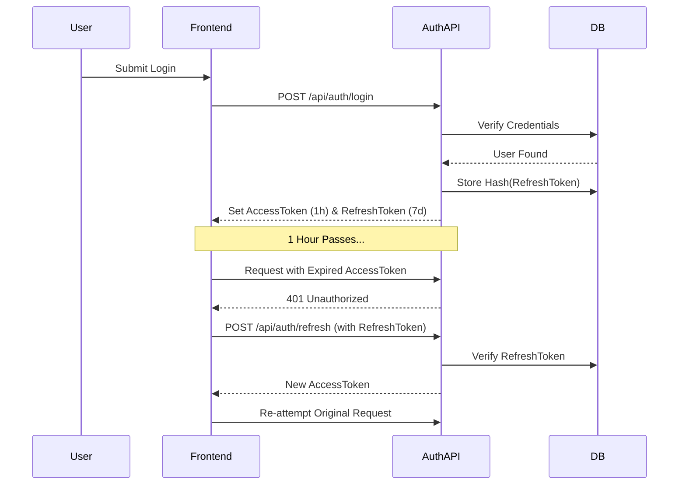

# CRM System – Role & Lead Assignment Data Flow

> **Visual diagram:** Open `DATA_FLOW.html` in your browser and press `Ctrl+P → Save as PDF` to generate the PDF.

---

## 1. System Role Assignment

```
                          ┌─────────────────────┐
                          │     SUPER ADMIN      │
                          │   (Creates Admins)   │
                          └──────────┬──────────┘
                                     │
          ┌──────────────────────────┼──────────────────────────┐
          ↓                          ↓                          ↓
  ┌───────────────┐        ┌─────────────────┐       ┌──────────────────┐   ┌──────────────────┐
  │    MANAGER    │ ←────→ │     ADMIN       │ ←───→ │  TEAM LEADER     │──▶│ CUSTOMER SUPPORT │
  │(Monitors Teams│        │ (Assigns Users) │       │(Reassigns Leads) │   │(Assigns New Leads│
  └───────────────┘        └─────────────────┘       └────────┬─────────┘   └──────────────────┘
                                                              ↓
                                                   ┌──────────────────┐
                                                   │    COUNSELOR     │
                                                   │ (Handles Leads)  │
                                                   └──────────────────┘
```

---

## 2. Lead Assignment Flow

```
  ┌────────────────────┐        ┌──────────────────┐        ┌─────────────────────────┐       ┌───────────────────────┐
  │  LEAD ENTRY POINT  │        │                  │        │    AI QUALIFICATION     │       │   MANUAL ASSIGNMENT   │
  │                    │        │  ROUTING RULES   │        │                         │       │                       │
  │  💬 WhatsApp       │ ──────▶│ (Configured by   │──────▶ │ ┌─────────────────────┐ │ ────▶ │ Support → TEAM LEADER │
  │  💙 Facebook       │        │    Admin)        │        │ │   AUTO Assignment   │ │       │ Support → Counselor   │
  │  🌐 Website        │        │                  │        │ └──────────┬──────────┘ │ ────▶ │                       │
  └────────────────────┘        └──────────────────┘        │            ↓            │       └───────────────────────┘
                                                            │ ┌─────────────────────┐ │
                                                            │ │  MANUAL Assignment  │ │
                                                            │ └─────────────────────┘ │
                                                            └─────────────────────────┘
                                                                         │
                                                                         ↓
```

---

## 3. Reporting & Monitoring

| Module                  | Responsible Role     | Description                         |
|-------------------------|----------------------|-------------------------------------|
| **Manager Reports**     | Manager              | Performance, funnel, SLA analytics  |
| **Team Leader Monitors**| Team Leader          | Lead status, counselor performance  |
| **Admin Configuration** | Admin                | Channels, routing, user management  |

---

## Role Responsibilities Summary

| Role             | Primary Responsibility                              |
|------------------|-----------------------------------------------------|
| Super Admin      | Creates and manages Admin accounts                  |
| Admin            | Assigns users, configures routing, channels, AI     |
| Manager          | Monitors team performance and analytics             |
| Team Leader      | Reassigns leads, monitors counselor workload        |
| Counselor        | Handles and closes leads                            |
| Customer Support | Receives new leads and assigns them to team/counselor|

## 4. Security & Authentication Flow (JWT Refresh)

The system uses a dual-token strategy for enhanced security and session permanence.



### Key Security Features:
- **Token Rotation**: New access tokens are issued without user intervention.
- **Session Revocation**: Storing the refresh token in the database allows for central logout/revocation.
- **HttpOnly (Planned)**: For production, refresh tokens should move to HttpOnly cookies.

---

*POVA CRM – Data Flow Document v1.1 – JWT Implementation Complete*
